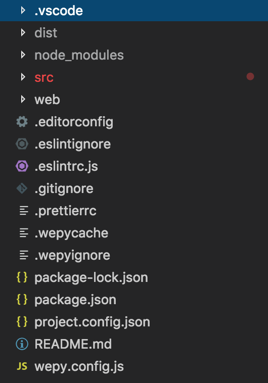

# wepy 框架

## 第一次接触小程序

最早接触小程序还是在2016，当时出了测试版本，朋友圈里面传的也比较多，后面陆续开放了api各种能力。

[两年前多例子](https://github.com/Jack-Rose/practice-wx_app)

## 回顾

上周通过官方文档、以及imooc回顾了下，小程序。

>几大变化

* 开发上支持个人开发者
* 小程序版本迭代，基础库多变化
* 开发时真机预览，调试

## 探索

集合最近前端变化，小程序原始的开发模式，似乎开发效率上似乎不是很高。

于是我搜索🔍了下，wepy框架

### wepy 框架特性

[官网](https://tencent.github.io/wepy/)

>wepy 有点像是vue2的工程版本

#### 构建

入门使用 wepy 就像vue-cli一样有，可以初始化一个工程，

```bash
npm install wepy-cli -g

wepy new your-project-name

cd  your-project-name

npm i
```

#### 生成文件

执行完了后就是下面这个目录，处了wepycache、dist 哈，

构建中间可以选择加入redux



#### 主要命令

pageage.json 里面看看

```json
{
    "script":{
        "dev": "wepy build --watch",
        "build": "cross-env NODE_ENV=production wepy build --no-cache",
        "dev:web": "wepy build --output web",
        "clean": "find ./dist -maxdepth 1 -not -name 'project.config.json' -not -name 'dist' | xargs rm -rf",
    }
}
```

npm run dev 开发启动

npm run build 构建生成小程序识别文件

npm run dev:web web浏览器查看

npm run clean 清除dist的非小程序配置文件

#### dist目录

npm run build 后产生文件夹。

在小程序开发工具中，需要引入这个目录就行

#### vscode 配置

配置后就像写vue了

```json
{
    "files.associations": {
        "*.wpy": "vue"
    },
}
```
